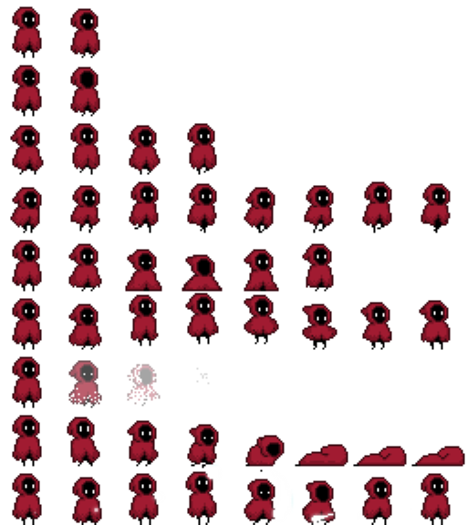
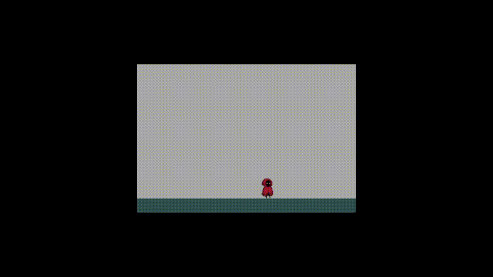

# TUTORIAL: Create C# game using Splashkit Animation to animate Sprite images

## A. What is animation?
Animations allow you to switch between images to create an animated effect. You can think of it like a flip book that change images quickly to create illusion of movements.

## B. What is Sprite?
A sprite is a two-dimensional image or animation that is integrated into a larger scene in video games and graphics. It's commonly used to represent characters, objects, and other elements in the game.



## D. What is an animation script file?
A configuration file for defining animations.
    ```txt
    SplashKit Animation

    //Frames are declared with an f: and contain
    //the following comma separated values
    //ID,CELL,DUR,NEXT
    //f: 0, 0, 10, 1
    //f: 1, 1, 10, 0

    // Set notation approach
    //Idle
    f:[0-1],[0-1], 20, 0
    f:[7-6],[7-6], 20, 7
    //Blink
    f:[8-9],[8-9], 20, 8
    //Run
    f:[24-31], [24-31], 5, 24
    //Jump
    f:[41-46], [41-46], 10, 41
    f:[72-77], [46-41], 10, 72
    //identifiers
    i:Idle, 0
    i:IdleLeft, 7
    i:Blink, 8
    i:Run, 24
    i:Jump, 41
    i:JumpLeft, 72

    ```

## E. Tutorial

### 1. Set up simple game mechanism

```cs
    // Program.cs
    using System;
    using SplashKitSDK;
    public class Program
    {
        public static void Main()
        {
            // Create game window
            Window gameWindow = new Window("Animation with Sprite", 620, 420);
            // Create the base ground
            Rectangle ground = new Rectangle
            {
                X = 0,
                Y = 380,
                Width = gameWindow.Width,
                Height = 40
            };
            
            // Create player
            Player player = new Player(gameWindow, ground);
            // Start game loop
            while (!gameWindow.CloseRequested)
            {
                SplashKit.ProcessEvents();
                player.HandleInput();
                gameWindow.Clear(Color.DarkGray);
                player.Update(ground);
                player.Draw();
                gameWindow.FillRectangle(Color.DarkSlateGray, ground);
                gameWindow.Refresh(60);
            }
        }
    }
```

### 2. Create Player Class
#### - Properties and Methods:
```cs
// Properties and Methods
    private Sprite _playerRight; // load right side animation
    private Sprite _playerLeft; // load left side animation
    private const int Speed = 5; // character movement speed
    private const int JumpSpeed = 10; // character jump speed
    private const float Gravity = 0.5f; // gravity level, higher mean stronger gravity
    private float _verticalVelocity = 0; // vertical jump velocity
    private bool _isJumping = false; // keep track of jumping status
    private bool _facingRight = true; // keep track of direction character is facing
    private bool _isMoving = false; // keep track of moving status
    public double X { get; set; } 
    public double Y { get; set; }
    public int Width
    {
        get
        {
            return _playerRight.Width;
        }
    }
    public int Height
    {
        get
        {
            return _playerRight.Height;
        }
    }
    public Player(Window window, Rectangle ground){} // set up sprite 
    public void Draw(){} // draw sprite
    public void Update(Rectangle ground){} // update character movement and animation
    public void HandleInput(){} // user control for animation and movement
    public bool IsOnGround(Rectangle ground){} // check if character has landed on the ground
    public void ResetJump(Rectangle ground){} // stop jumping action
```

#### - Player Constructor:

#####    Step 1 - Load Bitmap:
```cs
    Bitmap characterRight = SplashKit.LoadBitmap("PlayerRight", "Player.png");
    characterRight.SetCellDetails(characterRight.Width / 8, characterRight.Height / 9, 8, 9, 72); // cell width, height, cols, rows, count

    Bitmap characterLeft = SplashKit.LoadBitmap("PlayerLeft", "PlayerFlipped.png");
    characterLeft.SetCellDetails(characterLeft.Width / 8, characterLeft.Height / 9, 8, 9, 72); // cell width, height, cols, rows, count
```
#####    Step 2 - Load Animation Script:

```cs
    AnimationScript actionScript = SplashKit.LoadAnimationScript("ActionScript", "actionScript.txt");
```

#####    Step 3 - Create and Start the Sprites:

```cs
    _playerRight = SplashKit.CreateSprite(characterRight, actionScript);
    _playerLeft = SplashKit.CreateSprite(characterLeft, actionScript);
    _playerRight.StartAnimation("Idle");
    _playerLeft.StartAnimation("IdleLeft");
```

#####    Step 4 - Set character position:

```cs
    X = 20;
    Y = window.Height - ground.Height - _playerRight.Height;
```

#### - Draw Method:

#####    Step 5 - Draw Sprite according to "_facingRight" property:

```cs
    if (_facingRight)
    {
        SplashKit.DrawSprite(_playerRight, X, Y);
    }else{
        SplashKit.DrawSprite(_playerLeft, X, Y);
    }
```

#### - HandleInput Method:

#####    Step 6 - Start animation based on key typed:

```cs
    if (SplashKit.KeyTyped(KeyCode.RightKey))
    {
        _playerRight.StartAnimation("Run");
    }
    if (SplashKit.KeyTyped(KeyCode.LeftKey))
    {
        _playerLeft.StartAnimation("Run");
    }
    if (SplashKit.KeyTyped(KeyCode.SpaceKey) && !_isJumping)
    {
        _playerLeft.StartAnimation("JumpLeft");
        _playerRight.StartAnimation("Jump");
    }
```

#####    Step 7 - Move character based on key down:

```cs
    if (SplashKit.KeyDown(KeyCode.RightKey))
    {
        _facingRight = true;
        _isMoving = true;
        _playerRight.X += Speed;
        _playerLeft.X += Speed;
    }
    if (SplashKit.KeyDown(KeyCode.LeftKey))
    {
        _facingRight = false;
        _isMoving = true;
        _playerRight.X -= Speed;
        _playerLeft.X -= Speed;
    }
    if (SplashKit.KeyDown(KeyCode.SpaceKey))
    {
        _isJumping = true;            
        _verticalVelocity = -JumpSpeed;
    }
```

#####    Step 8 - Set Idle animation if character stop moving:

```cs

    if (!SplashKit.KeyDown(KeyCode.LeftKey) && !SplashKit.KeyDown(KeyCode.RightKey) && !SplashKit.KeyDown(KeyCode.SpaceKey) && _isMoving)
    {
        _isMoving = false;
        _playerRight.StartAnimation("Idle");
        _playerLeft.StartAnimation("IdleLeft");
    }
```

#### - IsOnGround Method:
#####    Step 10 - Create method to check if character landed on the ground:

```cs
    public bool IsOnGround(Rectangle ground){
        return Y + Height >= ground.Y;
    }
```
#### - ResetJump Method:
#####    Step 11 - Create method to stop Jump action:

```cs
    public void ResetJump(Rectangle ground)
    {
        if (_isJumping){
            _isJumping = false;
            _verticalVelocity = 0;
            Y = ground.Y - Height; // set the position the character stop

            // Start idle animation after jumping action ended
            if (_facingRight)
            {
                _playerRight.StartAnimation("Idle");
            }
            else
            {
                _playerLeft.StartAnimation("IdleLeft");
            }
        }
    }
```

#### - Update Method:
#####    Step 12 - Update character movement:

```cs

    public void Update(Rectangle ground)
    {
        if (_isJumping) 
        {
            // if character is jumping, update the next position and the velocity.
            // Velocity will decrease due to gravity

            _verticalVelocity += Gravity;
            Y += (int)_verticalVelocity;
        }
        if (IsOnGround(ground)) // if character laned on the ground, stop jumping action
        {
            ResetJump(ground);
        }

        // update animation of Sprites
        SplashKit.UpdateSpriteAnimation(_playerRight);
        SplashKit.UpdateSpriteAnimation(_playerLeft);
    }
```

### Game Result:
